# OpsPilot �Agentic RAG

OpsPilot 是一个面向企业知识问答的 Agentic RAG 项目。它使用
Python、LangChain å’?LangGraph 实现混合检索、证据评分、查询改写、失败重试、来源引用ã€?
无证据拒答、多轮上下文、Cross-Encoder 重排、LangSmith 追踪ï¼?
并通过 FastAPI å’?Streamlit 提供可演示产品ã€?
v0.11.0 进一步加å…?Streamlit
页面级自动化测试和统一发布验收证据，明确区分通过、失败与基础设施未配置的跳过项ã€?

默认 `local` 模式不需è¦?API Key，结果可重复，适合本地开发、持续集成和离线回归评测ï¼?
切换配置后可以使ç”?OpenAI 或兼容接口完成真å®?Embedding、查询改写和答案生成ã€?

在线仓库：[github.com/sdhgngfh/opspilot-rag](https://github.com/sdhgngfh/opspilot-rag)

[](https://github.com/sdhgngfh/opspilot-rag/actions/workflows/ci.yml)

快速了解完整链路可使用 [项目演示与技术评审指南](docs/DEMO_GUIDE.md)；各版本变更è§?
[CHANGELOG](CHANGELOG.md)。执行优先级、验收边界和后续工作è§?
[项目路线图与验收状态](docs/ROADMAP.md)，架构、指标和工程取舍è§?
[项目架构与工程能力概览](docs/PROJECT_OVERVIEW.md)；无法现场启动服务时可直接查çœ?
[关键流程截图](docs/DEMO_SCREENSHOTS.md)ã€?

## 已完成功èƒ?

### 基础 RAG

- Markdown、TXT、PDF 文档加载
- `RecursiveCharacterTextSplitter` 分块及稳å®?`chunk_id`
- LangChain `InMemoryVectorStore` 向量检索与磁盘持久åŒ?
- 本地可重å¤?Hash Embedding，支持中文字ç¬?n-gram
- 无外部分词服务的中英æ–?BM25 检ç´?
- 向量ä¸?BM25 双路召回、加æ?RRF 融合
- 基于向量、BM25、词项覆盖率å’?RRF 的可解释重排
- 可é€?Sentence Transformers Cross-Encoder 二阶段语义重æŽ?
- 双信号证据门控、无证据拒答和结构化来源引用
- `vector`、`hybrid`、`hybrid_rerank` 三种策略对照评测

### LangGraph 工作æµ?

- `StateGraph` 显式状态和条件è¾?
- 多轮问题指代补全
- 本地确定性或大模型查询改å†?
- 检索证据评分及原因说明
- 最å¤?N 次有界重写与重新检ç´?
- 直接回答、重试恢复、最终拒答三类路å¾?
- 每轮完整执行路径和检索尝试记å½?
- 使用 `thread_id` 延续多轮会话
- SQLite/PostgreSQL Checkpointer 跨进程、跨实例持久åŒ?
- 基础 RAG ä¸?LangGraph RAG 的图级对照评æµ?

### 工具调用与人工审æ‰?

- 将自然语言运维请求生成结构化工单草ç¨?
- 使用 LangChain `StructuredTool` 封装持久åŒ?`submit_ticket` 工具
- 在写操作前调ç”?LangGraph `interrupt()` 强制暂停
- 支持批准、修改后批准、拒绝三种决å®?
- `Command(resume=...)` ä»?SQLite æˆ?PostgreSQL checkpoint 恢复执行
- 中断前零业务写入，拒绝路径不调用提交工具
- 使用 `workflow_id` 幂等写入，防止恢复或重试造成重复工单
- 返回待执行工具参数、执行路径和完整审计事件
- 工单工作æµ?API 与独立离线评æµ?

### 工程能力

- FastAPI：基础问答、图工作流问答、工单审批、会话状态、上传、重建索å¼?
- Streamlit：知识问答、引用证据、执行轨迹、工单审批和知识库管ç?
- JWT Bearer 登录、PBKDF2 密码哈希和短期访问令ç‰?
- 企业 OIDC/JWKS 令牌校验与外éƒ?subject 账号映射
- 用户角色、部门和 scope 三层授权
- 文档 ACL 在召回阶段过滤，未授权证据不会进入重排、生成或引用
- 相同 `thread_id` 按用户命名空间隔ç¦?
- Prompt Injection 不可信数据边界、污染文档过滤和跨身份工单碰撞防æŠ?
- 向量索引和业务状态均可在本地/PostgreSQL 间独立切æ?
- 用户、工单、RAG 会话和待审批中断可统一持久化到 PostgreSQL
- HTTP 审计日志、请æ±?ID、保留期清理和管理员查询接口
- 单机内存/多实ä¾?PostgreSQL 原子固定窗口限流
- å¸?SHA-256 漂移检测和 advisory lock 的事务迁ç§?
- `pg_dump` 自定义格式备份、清单哈希校验和恢复目标确认
- 隔离数据库恢复演练及关键表行数核å¯?
- 存活、就绪健康检查与生产发布门禁
- LangSmith：通过环境配置启用 LangChain/LangGraph 全链路追è¸?
- 低基æ•?Prometheus RED 指标ä¸?RAG/审批业务指标
- 不记录问题正文、用æˆ?ID æˆ?thread ID çš?OpenTelemetry OTLP/HTTP trace
- 99.5% 可用率ã€? ç§?P95 初始 SLO 与错误预算燃烧告è­?
- 可重复并发压测、OTLP exporter 冒烟和数据库依赖故障演练
- `/v1/system/info` 安全展示运行模式，不返回密钥
- 8 份易混淆演示文档
- 36 条基础检索ã€?0 条图级ã€?2 条权限和 3 条审批路径评测数æ?
- pytest、Ruff、GitHub Actions、PostgreSQL 集成和真实恢复演ç»?
- Streamlit AppTest 页面状态、断连降级与问答成功路径
- 可复现统一验收、产ç‰?SHA-256、敏感输出脱敏和机器可读证据
- 本地模式无需 API Key，结果可重复，适合本地开发与演示

## 检索与重排架构

```mermaid
flowchart LR
    Q["用户问题"] --> V["向量召回"]
    Q --> B["BM25 召回"]
    V --> F["RRF 融合候é€?]
    B --> F
    F --> C["Cross-Encoder 或本地重æŽ?]
    C --> G["证据门控"]
```



默认本地重排保证离线环境å’?CI 无需下载模型也能运行。启ç”?Cross-Encoder 后，
只对 `CANDIDATE_K` 个融合候选计ç®?query-document 成对分数，再与可解释本地分数融合ï¼?
它不会替代向é‡?BM25 召回，因此不会对整个知识库逐条运行模型ã€?

## LangGraph 架构

```mermaid
flowchart TD
    S["START"] --> P["准备 / 上下文化"]
    P --> R["混合检ç´?]
    R --> G["证据评分"]
    G -->|充分| A["约束生成"]
    G -->|不足且可重试| W["查询改写"]
    W --> R
    G -->|重试耗尽| F["明确拒答"]
    A --> Z["记录会话"]
    F --> Z
    Z --> E["END"]
```

LangChain 负责 `Document`、文本切分、Embedding、VectorStore、消息和模型接口ï¼?
LangGraph 负责状态、条件路由、循环、checkpoint 和会话恢复。检索器与图编排解耦，
所以可以先独立验证检索质量，再判断查询改写和重试是否带来增益ã€?

每次图调用都会返回类似下面的可审计信息：

```json
{
  "thread_id": "demo-001",
  "retrieval_query": "接口请求重复了怎么办？ 集成接口 请求 响应 错误ç ?,
  "rewrite_count": 1,
  "evidence_score": 0.444958,
  "execution_path": [
    "prepare_query",
    "retrieve",
    "grade_evidence",
    "rewrite_query",
    "retrieve",
    "grade_evidence",
    "generate_answer",
    "finalize"
  ]
}
```

## 人工审批架构

```mermaid
flowchart TD
    S["运维请求"] --> D["生成工单草稿"]
    D --> I["interrupt 暂停"]
    I -->|批准| T["submit_ticket 工具"]
    I -->|修改后批准| T
    I -->|拒绝| X["取消提交"]
    T --> P["SQLite / PostgreSQL 工单åº?]
```

`submit_ticket` 是有副作用的业务工具，只能出现在审批节点之后。图åœ?
`interrupt()` 处保存状态，并把完整工具参数返回给调用者；恢复时使用相å?
`thread_id` å’?`Command(resume=...)`。提交工具以 `workflow_id` 作为唯一幂等键，
即使恢复后发生重试，也只会得到同一张工单ã€?

## 身份与知识权限架æž?

```mermaid
flowchart TD
    L["本地登录 / 企业 OIDC"] --> J["已验证身ä»?]
    J --> S["Scope 检æŸ?]
    S --> A["角色 + 部门 ACL"]
    A --> R["授权候选召å›?]
    R --> G["重排与生æˆ?]
```



本地 JWT 只保存用æˆ?ID；OIDC token ç»?JWKS、issuer å’?audience 校验后，只用
`issuer|sub` 映射账号。两种模式都会在每次请求重新读取当前用户状态，因此禁用账号
或修改角色后，旧令牌不会继续携带过期授权。`knowledge:read` 决定能否检索，文档çš?
`allowed_roles` ä¸?`allowed_departments` 决定能检索哪些分块；两项必须同时匹配ã€?
`knowledge:read:all` 只授予管理员ã€?

本地索引会扩大候选池后在进入重排前过滤；pgvector 后端则把 ACL 条件直接放入
SQL `WHERE`，避免先从数据库取出未授权向量。上传文档时 ACL 与文档一起写入，
重建失败会一起回滚。访问策略位äº?`data/security/document_access.json`ï¼?
其内容也参与索引指纹计算ã€?

## 评测结果

### 基础检索对ç…?

本地可重复模式、`Top-K=4`，在 8 份演示文档和 36 条人工整理的合成评测问题上：

| 策略 | Hit Rate@4 | MRR | 答案关键词召å›?| 拒答准确çŽ?|
|---|---:|---:|---:|---:|
| 仅向é‡?| 1.000 | 0.952 | 0.720 | 0.944 |
| 向量 + BM25 + RRF | 1.000 | 0.952 | 0.785 | 1.000 |
| 混合检ç´?+ 重排 | 1.000 | 0.984 | 0.806 | 1.000 |

按难度分层后，hard 样本çš?`MRR=0.950`、答案关键词召回ä¸?`0.667`ï¼?
低于 easy 样本çš?`1.000` å’?`0.926`。正确来源已召回，但复杂约束的答案要点组å?
仍是下一步重点。完整问题类型、难度和角色切片è§?
[分层评测说明](docs/EVALUATION.md)ã€?

### LangGraph 对照

åœ?10 条包含口语化弱查询、精确错误码和无答案问题的图级评测数据上ï¼?

| 指标 | 基础 RAG | LangGraph RAG |
|---|---:|---:|
| 回答/拒答决策准确çŽ?| 0.700 | 1.000 |
| 期望来源命中çŽ?| 0.571 | 1.000 |
| 答案关键词召å›?| 0.429 | 0.643 |
| 平均延迟 | 1.98 ms | 6.77 ms |

图工作流的平均检索次数为 `1.6`，发生改写的样本å?`60%`ï¼?
在需要重试的可回答问题中，重试恢复率ä¸?`1.0`ã€?

### 消融实验

单变量消融验证了当前默认组合ï¼?

- BM25/RRF 相比仅向量使答案关键词召回提å?`0.065`，决策准确率提升 `0.056`ï¼?
- 本地重排ä½?MRR 再提å?`0.032`ï¼?
- 证据阈å€?`0.12` 会放行全éƒ?5 个越界问题，`0.24` 会误拒可回答问题，保ç•?`0.18`ï¼?
- 允许 1 次查询改写使图级决策准确率从 `0.700` 提升åˆ?`1.000`；第 2 次没有质量增益，
  因此默认 `MAX_REWRITES=1`ã€?

完整对照、失败样本和实验边界è§?[消融实验报告](docs/ABLATION.md)ã€?

这些结果来自小规模、受控的演示数据，且本地改写包含领域同义词规则，
只能说明当前工程链路和回归样本表现，不能外推为生产效果。真实项目还应引入双人独ç«?
标注和线上反馈，并将规则改写ä¸?LLM 改写、不同阈值和不同模型分别做消融实验ã€?

### 工单审批工作æµ?

在批准、修改、拒ç»?3 条受控路径上ï¼?

| 指标 | 结果 |
|---|---:|
| 审批屏障通过çŽ?| 1.000 |
| 决策执行准确çŽ?| 1.000 |
| 修改参数准确çŽ?| 1.000 |
| 提交幂等çŽ?| 1.000 |

审批屏障要求工作流已经暂停并返回待审批参数，同时业务工单库仍为零新增ã€?
该评测主要验证控制流和副作用边界，不评价大模型生成的工单文本质量ã€?

### 知识权限评测

在销售、支持和运维三类身份çš?12 条允è®?拒绝路径上：

| 指标 | 结果 |
|---|---:|
| 访问决策准确çŽ?| 1.000 |
| 未授权目标来源泄漏率 | 0.000 |
| 返回候é€?ACL 完整çŽ?| 1.000 |

三个角色切片的访问决策准确率均为 `1.000`，未授权来源泄漏率均ä¸?`0.000`ã€?
该数据集验证受保护来源是否按角色与部门出现，以及所有返回候选是否都能通过同一 ACLã€?
对抗性安全覆盖见 [Prompt Injection、恶意文档与跨身份测试](docs/SECURITY_TESTS.md)ã€?
这些测试不替代渗透测试、数据库 RLS 或企业身份系统测试ã€?

### 本地 SLO 容量验收

本地确定性模型ã€?00 个有效基础 RAG 请求、并å?8ï¼?

| 指标 | 结果 |
|---|---:|
| 成功请求 | 100/100 |
| 可用çŽ?| 1.000 |
| 吞吐 | 214.4 req/s |
| P50 | 33.6 ms |
| P95 | 52.3 ms |
| P99 | 56.0 ms |
| SLO 门禁 | 通过 |

完整结果位于 `reports/load_test.json`。该测试用于证明压测、指标和门禁链路可重复执行；
本地 Hash Embedding 与抽取式答案的吞吐不能外推到在线模型、Cross-Encoder 或生产数据库ã€?

### v0.11.0 本地全量验收状æ€?

以下结果来自 2026-07-26 的本地隔离环境；PostgreSQL 17/pgvector 运行在临时容器，
恢复目标为独立数据库ã€?

| 项目 | 结果 |
|---|---:|
| 纯本地测è¯?| 101 通过 |
| PostgreSQL 集成测试 | 2/2 通过 |
| PostgreSQL 迁移 | 2/2 已应用，状态一è‡?|
| 隔离恢复演练 | 通过ï¼? 张关键表行数一è‡?|
| 总覆盖率 | 86.5% |
| Streamlit 页面覆盖çŽ?| 49.0% |
| PostgreSQL 索引适配器覆盖率 | 86.7% |
| PostgreSQL 用户/工单适配器覆盖率 | 94.4% |
| Ruff | 通过 |
| 统一验收 | 10/10 通过ï¼? 跳过 |

该结果证明仓库在当前环境中的代码与评测链路可复现ã€?

## 1. 本地运行与演示界é?

需è¦?Python 3.11 æˆ?3.12，并安装 [uv](https://docs.astral.sh/uv/)ã€?

```bash
cd opspilot-rag
cp .env.example .env
uv sync --extra dev --extra demo
uv run python scripts/ingest.py
uv run uvicorn app.api:app --reload
```

另开一个终端启动界面：

```bash
uv run streamlit run frontend/streamlit_app.py
```

浏览器打开ï¼?

- 演示界面ï¼?http://127.0.0.1:8501>
- Swaggerï¼?http://127.0.0.1:8000/docs>
- 健康检查：<http://127.0.0.1:8000/health>
- 存活检查：<http://127.0.0.1:8000/health/live>
- 就绪检查：<http://127.0.0.1:8000/health/ready>
- 运行配置ï¼?http://127.0.0.1:8000/v1/system/info>
- Prometheus 指标ï¼?http://127.0.0.1:8000/metrics>（需启用ï¼?

演示建议按“弱查询自动改写 â†?查看证据和执行路å¾?â†?创建工单 â†?
确认中断前未提交 â†?修改优先级并批准”的顺序操作ã€?

## 2. 调用基础 RAG

基础接口只执行一次检索，便于作为对照基线ï¼?

```bash
curl -X POST http://127.0.0.1:8000/v1/ask \
  -H "Content-Type: application/json" \
  -d '{"question":"为什么用户还能看到其他部门的销售订单？"}'
```

## 3. 调用 LangGraph RAG

第一次提问：

```bash
curl -X POST http://127.0.0.1:8000/v1/graph/ask \
  -H "Content-Type: application/json" \
  -d '{
    "question":"销售订单审核失败应该检查什么？",
    "thread_id":"opspilot-demo"
  }'
```

使用相同 `thread_id` 追问ï¼?

```bash
curl -X POST http://127.0.0.1:8000/v1/graph/ask \
  -H "Content-Type: application/json" \
  -d '{
    "question":"这个问题怎么处理ï¼?,
    "thread_id":"opspilot-demo"
  }'
```

查询持久化会话状态：

```bash
curl http://127.0.0.1:8000/v1/graph/threads/opspilot-demo
```

`thread_id` æ˜?checkpoint 的会话游标。服务重启后重新使用相同 ID，本地模式从
`data/state/checkpoints.sqlite` 恢复；`PERSISTENCE_BACKEND=postgres` 时从
PostgreSQL 恢复。RAG 与工单线程分别使ç”?`rag:`、`ticket:` 内部前缀隔离ã€?

## 4. 创建并审批工å?

创建草稿，工作流会在提交前暂停：

```bash
curl -X POST http://127.0.0.1:8000/v1/tickets/workflows \
  -H "Content-Type: application/json" \
  -d '{
    "request_text":"销售人员可以看到其他部门订单，请创建权限修复工单ã€?,
    "requester":"alice",
    "thread_id":"ticket-demo"
  }'
```

批准提交ï¼?

```bash
curl -X POST http://127.0.0.1:8000/v1/tickets/workflows/ticket-demo/review \
  -H "Content-Type: application/json" \
  -d '{"action":"approve","reviewer":"ops-lead"}'
```

也可以在审批时修改草稿并视为批准修改后的工具参数ï¼?

```bash
curl -X POST http://127.0.0.1:8000/v1/tickets/workflows/ticket-edit/review \
  -H "Content-Type: application/json" \
  -d '{
    "action":"edit",
    "reviewer":"ops-lead",
    "changes":{"priority":"critical","title":"修复跨部门订单越权访é—?}
  }'
```

拒绝时使ç”?`{"action":"reject","reviewer":"security-lead"}`，不会写入工单库ã€?
可通过 `GET /v1/tickets/workflows/{thread_id}` 查询审批状态和审计轨迹ï¼?
通过 `GET /v1/tickets/{ticket_id}` 查询已提交工单ã€?

## 5. 运行评测和测è¯?

```bash
uv run python scripts/evaluate.py \
  --output reports/evaluation.json

uv run python scripts/benchmark_retrieval.py \
  --output reports/retrieval_comparison.json

uv run python scripts/evaluate_graph.py \
  --output reports/graph_evaluation.json

uv run python scripts/evaluate_tickets.py \
  --output reports/ticket_workflow_evaluation.json

uv run python scripts/evaluate_access.py \
  --output reports/access_evaluation.json

uv run python scripts/load_test.py \
  --scenario ask \
  --requests 100 \
  --concurrency 8 \
  --output reports/load_test.json \
  --require-slo

uv run python scripts/otel_smoke.py

uv run pytest
uv run ruff check .

# 一次执行本地可复验项，并记录基础设施跳过边界
uv run python scripts/acceptance.py
```

基础评测集位äº?`data/evaluation/dataset.jsonl`，图级评测集位于
`data/evaluation/graph_dataset.jsonl`。每行格式：

```json
{
  "id": "perm-01",
  "question": "如何限制用户只能看本部门订单ï¼?,
  "answerable": true,
  "question_type": "policy",
  "difficulty": "easy",
  "expected_sources": ["u9c_permissions.md"],
  "answer_keywords": ["数据权限", "销售部é—?]
}
```

基础评测指标ï¼?

- Hit Rate@K：Top-K 是否至少命中一个期望来æº?
- Recall@K：期望来源被召回的比ä¾?
- MRR：第一个正确来源排名的倒数均å€?
- Answer Keyword Recall：参考要点在回答中的覆盖çŽ?
- Abstention Accuracy：该回答时回答、无证据时拒答的准确çŽ?
- Breakdowns：按问题类型和难度重复计算同一组指标；访问评测额外按角色分å±?

图级评测额外统计ï¼?

- Decision Accuracy：回答或拒答的决策是否正ç¡?
- Rewrite Rate：进入查询改写路径的样本比例
- Retry Recovery Rate：需要改写的可回答问题中，被重试成功恢复的比ä¾?
- Average Attempts：每个问题平均执行多少次检ç´?
- 图工作流相对基础 RAG 的质量和延迟变化

统一验收会生成：

- `reports/acceptance.json`：命令、状态、耗时、输出尾部和产物 SHA-256
- `reports/ACCEPTANCE.md`：适合人工审阅的验收摘è¦?
- `reports/coverage.json`：逐文件覆盖率

没有设置 `TEST_DATABASE_URL` 或恢复数据库时，PostgreSQL 验收会明确标ä¸?
`skipped`，总状态为 `partial`，不会把未执行项目算作通过。生产发布环境使用：

```bash
uv run python scripts/acceptance.py --require-infrastructure
```

此时缺少真实 PostgreSQL/pgvector 或备份恢复环境会直接使验收失败ã€?

审批评测额外检查：

- Approval Barrier：暂停时不得产生业务写入
- Decision Accuracy：批准、修改、拒绝是否进入正确路å¾?
- Edit Accuracy：修改后的工具参数是否被实际提交
- Submission Idempotency：重复的副作用请求是否只生成一张工å?

## 6. 配置

默认配置ï¼?

```dotenv
RAG_MODE=local
EMBEDDING_PROVIDER=local
RERANKER_PROVIDER=local
INDEX_BACKEND=local
PERSISTENCE_BACKEND=local
RETRIEVAL_STRATEGY=hybrid_rerank
TOP_K=4
CANDIDATE_K=12
MIN_RELEVANCE_SCORE=0.18
MIN_BM25_SCORE=0.80
MIN_LEXICAL_COVERAGE=0.12
VECTOR_WEIGHT=0.55
BM25_WEIGHT=0.45
RRF_K=60
MAX_REWRITES=1
CONVERSATION_HISTORY_LIMIT=8
CHECKPOINT_PATH=data/state/checkpoints.sqlite
TICKET_CHECKPOINT_PATH=data/state/ticket_checkpoints.sqlite
TICKET_STORE_PATH=data/state/tickets.sqlite
AUTH_ENABLED=false
AUTH_PROVIDER=local
AUTH_STORE_PATH=data/state/users.sqlite
ACCESS_POLICY_PATH=data/security/document_access.json
AUDIT_ENABLED=false
RATE_LIMIT_ENABLED=false
METRICS_ENABLED=false
OTEL_TRACING_ENABLED=false
SLO_AVAILABILITY_TARGET=0.995
SLO_P95_LATENCY_MS=5000
SLO_MIN_REQUESTS=20
```

- `vector`：仅使用向量相似度，作为实验基线ã€?
- `hybrid`：向量和 BM25 分别召回，使用加æ?RRF 融合ã€?
- `hybrid_rerank`：在融合候选上计算可解释重排分数ã€?
- `RERANKER_PROVIDER=local`：无需模型下载的确定性重排，适合测试与现场兜底ã€?
- `RERANKER_PROVIDER=cross_encoder`：对融合候选执行真实成对语义重排ã€?
- `MAX_REWRITES`：证据不足时最多改写与重试次数ã€?
- `CONVERSATION_HISTORY_LIMIT`：每ä¸?thread 保留的最近对话轮数ã€?
- `CHECKPOINT_PATH`：LangGraph SQLite checkpoint 文件ã€?
- `TICKET_CHECKPOINT_PATH`：工单审批中断与恢复çš?checkpoint 文件ã€?
- `TICKET_STORE_PATH`：已批准工单的业务数据文件ã€?
- `INDEX_BACKEND=local`：本地可重复索引；`postgres`：pgvector 向量召回ã€?
- `PERSISTENCE_BACKEND=local`：SQLite 用户/工单/checkpoint；`postgres`：统一 PostgreSQLã€?
- `AUTH_ENABLED`：是否强制登录。开启时必须配置至少 32 字符的随机密钥ã€?
- `AUTH_PROVIDER`：`local` 使用本地密码和短æœ?JWT；`oidc` 校验企业 IdP tokenã€?
- `AUDIT_ENABLED`：记录请æ±?ID、操作者、路径、状态和延迟，不记录请求正文或令牌ã€?
- `RATE_LIMIT_ENABLED`：启用固定窗口限流；PostgreSQL 模式可在多实例间共享计数ã€?
- `ACCESS_POLICY_PATH`：文档角色、部门和密级映射ã€?
- `METRICS_ENABLED`：启ç”?`/metrics`；标签只包含路由模板等有限维度ã€?
- `OTEL_TRACING_ENABLED`：通过 OTLP/HTTP 输出请求、检索、生成和工作æµ?spanã€?
- `SLO_*`：并发验收所用的最小样本数、可用率和成功请æ±?P95 门限ã€?
- `KNOWLEDGE_MUTATIONS_ENABLED`：是否允è®?API 进程直接上传或重建知识ã€?

审计事件只记录请求元数据，不保存正文、密码或 Bearer Token。拥æœ?`audit:read`
scope 的管理员可调ç”?`GET /v1/audit/events?limit=100`；定时执è¡?
`uv run python scripts/purge_audit.py` 会按 `AUDIT_RETENTION_DAYS` 清理ã€?

证据门控要求综合分达标，并且向量信号达标，或 BM25 与词项覆盖率同时达标ã€?
这样可避免“午餐菜单”仅因一个“菜单”词命中“菜单权限”后直接作答ã€?


## 7. 启用真实 Cross-Encoder

安装可选依赖：

```bash
uv sync --extra dev --extra demo --extra reranker
```

编辑 `.env`ï¼?

```dotenv
RERANKER_PROVIDER=cross_encoder
CROSS_ENCODER_MODEL=cross-encoder/mmarco-mMiniLMv2-L12-H384-v1
CROSS_ENCODER_DEVICE=cpu
CROSS_ENCODER_BATCH_SIZE=8
CROSS_ENCODER_WEIGHT=0.80
```

模型会在第一次检索时下载。默认模型支持包括中文在内的多语言检索场景；
CPU 可运行但延迟会显著高于本地规则重排。正式对照实验应分别记录 MRRã€?
Recall@K å’?P95 延迟，不能只比较单个问答效果ã€?

## 8. 启用 LangSmith 追踪

编辑 `.env`ï¼?

```dotenv
LANGSMITH_TRACING=true
LANGSMITH_API_KEY=你的LangSmith密钥
LANGSMITH_PROJECT=opspilot-rag
```

服务启动时会在任ä½?LangChain/LangGraph 工作执行前配置追踪。不开启时不需要密钥，
也不会发é€?trace。`GET /v1/system/info` 只返回追踪是否开启和项目名，不暴露密钥ã€?

建议技术评审时展示一次包含改写重试的 LangGraph trace，以及一次在 `interrupt()`
暂停、恢复后调用 `submit_ticket` çš?traceã€?

## 9. 切换真实生成ä¸?Embedding 模型

编辑 `.env`ï¼?

```dotenv
RAG_MODE=openai
EMBEDDING_PROVIDER=openai
OPENAI_API_KEY=你的密钥
OPENAI_BASE_URL=
CHAT_MODEL=gpt-5-mini
EMBEDDING_MODEL=text-embedding-3-small
```

`RAG_MODE=openai` 会同时启用真实答案生成和 LLM 查询改写ã€?
如果只想比较生成质量，可以保ç•?`EMBEDDING_PROVIDER=local`，从而固定检索变量ã€?

若使用兼å®?OpenAI Chat Completions 的服务，å°?`OPENAI_BASE_URL` 改为服务çš?
`/v1` 地址，并使用该服务支持的模型名。Embedding 提供方改变后，索引清单会检æµ?
签名变化并自动重建向量ã€?

### 真实模型质量、延迟、Token 与成æœ?

真实模型评测固定使用本地 Embedding，避免把检索变量与生成模型变量混在一起ã€?
价格不写死在代码中，执行时必须提供带日期和来源的价格快照ï¼?

```bash
uv run python scripts/evaluate_online_model.py \
  --input-price <美元/百万输入Token> \
  --output-price <美元/百万输出Token> \
  --cached-input-price <美元/百万缓存输入Token> \
  --pricing-as-of <YYYY-MM-DD> \
  --pricing-source <价格来源> \
  --output reports/online_model_evaluation.json
```

报告包含问题类型/难度切片、端到端与模åž?P50/P95、输å…?输出/缓存/推理 Tokenï¼?
以及总成本和单请求成本。模型不返回 Token 用量时命令会失败，不会用估算值补齐ã€?
当前仓库没有提交 API Key，也没有把本地结果描述为线上模型结果；完整执行口径见
[真实模型评测](docs/ONLINE_MODEL_EVALUATION.md)ã€?

## 10. 项目结构

```text
opspilot/
├── app/
â”?  ├── config.py               # 环境配置
â”?  ├── embeddings.py           # 本地/在线 Embedding
â”?  ├── evaluation.py           # 基础离线指标
â”?  ├── generator.py            # 本地/在线答案生成
â”?  ├── graph/
â”?  â”?  ├── rewriting.py        # 本地/在线查询改写
â”?  â”?  ├── state.py            # 图状态和证据序列åŒ?
â”?  â”?  └── workflow.py         # RAG StateGraph、条件边å’?checkpoint
â”?  ├── graph_evaluation.py     # 基础与图工作流对ç…?
â”?  ├── health.py               # 健康检æŸ?
â”?  ├── index.py                # 索引版本和检ç´?
â”?  ├── loaders.py              # 文档解析和分å?
â”?  ├── models.py               # API/评测数据模型
â”?  ├── persistence.py          # Checkpointer 工厂
â”?  ├── reranking.py            # Cross-Encoder 适配å™?
â”?  ├── retrieval.py            # BM25、RRF 和本地重æŽ?
â”?  └── service.py              # 基础 RAG 服务
├── frontend/
â”?  ├── client.py               # FastAPI 客户ç«?
â”?  └── streamlit_app.py        # Streamlit 演示界面
├── data/
â”?  ├── knowledge/              # 示例知识åº?
â”?  ├── evaluation/             # 检索与图评测集
â”?  └── state/                  # 本地 SQLite 状æ€?
├── docs/
â”?  ├── EVALUATION.md           # 评测指标与限åˆ?
â”?  ├── DEMO_GUIDE.md           # 项目演示路线
â”?  ├── PROJECT_OVERVIEW.md     # 架构与工程能力概è§?
â”?  └── ROADMAP.md              # 路线图与后续工作
├── scripts/
â”?  ├── ingest.py               # 文档入库
â”?  ├── evaluate.py             # 基础评测
â”?  ├── benchmark_retrieval.py  # 检索对ç…?
â”?  └── evaluate_graph.py       # 图级评测
├── tests/
└── pyproject.toml
```

## 11. 设计决策与验证要ç‚?

1. 为什么基础 RAG å’?LangGraph 接口同时保留ï¼?
   基础接口是可重复的实验对照组。没有对照组，无法证明改写和重试是优化还是只增加复杂度ã€?

2. 为什么不让模型无限重试？
   检索重试必须有上限，否则会扩大延迟、成本和错误累积。当前通过
   `MAX_REWRITES` 形成确定的停止条件ã€?

3. 为什么状态中保存序列化证据？
   checkpoint 应只保存稳定、可序列化的数据，而不是依赖进程内对象身份ã€?
   恢复时再重建 `Document` 和检索分数对象ã€?

4. 如何解释证据是否充分ï¼?
   图中有独ç«?`grade_evidence` 节点，综合检查重排分、向量分ã€?
   BM25 和词项覆盖率；响应返回分数、原因和每次尝试，便于调试阈值ã€?

5. 为什ä¹?Cross-Encoder 不直接搜索整个知识库ï¼?   Cross-Encoder 必须联合编码每个 query-document 对，质量更高但计算昂贵ã€?
   当前先用向量ä¸?BM25 高召回地缩小åˆ?`CANDIDATE_K` 个候选，再执行精排ã€?

7. 为什ä¹?`interrupt()` 放在工具之前ï¼?
   模型可以生成草稿和建议，但任何有副作用的提交都必须由人确认。中断前只保å­?
   checkpoint，不写业务库；批准后才执è¡?`submit_ticket`ã€?

8. 为什么提交工具还要做幂等ï¼?
   人工审批保证“是否允许执行”，但不能消除网络重试、进程崩溃或恢复重放ã€?
   `workflow_id` 唯一约束保证同一审批只产生一个业务结果ã€?

9. 为什ä¹?LangSmith 是可选能力？
   离线测试不应依赖外部服务；开启后可观察节点耗时、模型调用、检索重试和工具执行ï¼?
   关闭后核心业务行为必须完全相同ã€?

10. 当前最大局限是什么？
    36 条人工整理的合成评测样本仍小，未做双人标注一致性统计；本地改写仍包含领域规则，
    Cross-Encoder 默认模型也未经企业语料微调。下一步应加入线上反馈闭环、独立复标，
    并用真实工单沙箱验证ã€?

11. 为什么权限过滤必须在召回阶段ï¼?
    如果先取回未授权文档再在回答末尾隐藏引用，内容仍可能进入重排、模型上下文å’?traceã€?
    当前本地ä¸?pgvector 两个后端都在候选进入这些环节前执行 ACLã€?

12. 为什ä¹?JWT 里不直接保存角色ï¼?
    角色写进令牌会一直有效到令牌过期。当前令牌只保存用户 ID，每次请求重新读取账号，
    让停用账号和撤销权限立即生效；代价是多一次身份存储查询ã€?

13. “修改”为什么等于修改后批准ï¼?
   审批响应同时表达了决定和新参数。修改内容先经过 Pydantic 校验，再替换
   pending tool call 的参数，随后执行；原始草稿、决定和最终参数都可审计ã€?

14. OIDC token 里已有角色，为什么还查用户表ï¼?
   外部 token 只建立身份真实性，应用授权仍以当前用户表为准。这样企业账号与应用 scope
   可以独立撤销，也避免æŠ?IdP 的通用角色直接等同于知识库和工具权限ã€?

15. 多实例限流如何避免竞态？
   PostgreSQL 后端使用 `INSERT ... ON CONFLICT DO UPDATE ... RETURNING` 原子增加窗口计数ï¼?
   同一客户端和窗口只有一行。单机演示则使用带锁内存计数，不引入数据库依赖ã€?

16. 为什么迁移文件执行后不能直接修改ï¼?
   数据库只知道某个版本已执行，不知道开发者后来改了什么。记录文ä»?SHA-256 并在发布å‰?
   对比，可以把不可重复的历史修改变成明确失败；新变化必须写成新迁移ã€?

17. 为什么备份成功还要做恢复演练ï¼?
   文件存在不代表可恢复。演练同时验证备份工具版本、哈希、目标权限、扩展、DDL、数据和
   checkpoint，并用隔离数据库避免触碰生产库ã€?

18. 为什么指标不能直接把路径和用æˆ?ID 当标签？
   Prometheus 会为每种标签组合创建时间序列。真å®?ID、问题文本和 thread ID 会造成
   基数爆炸，同时泄漏业务内容；因此只记录路由模板、状态类别和有限枚举ã€?

19. LangSmith ä¸?OpenTelemetry 为什么同时存在？
   LangSmith 适合检æŸ?prompt、模型调用、图节点和工具轨迹；OpenTelemetry 用统一协议
   串联 HTTP、数据库和其他服务。两者用途不同，且都必须可关闭而不改变业务语义ã€?

20. 为什么故障时 liveness 仍为 200、readiness 返回 503ï¼?
   进程仍健康时不应被容器运行时反复重启，但数据库或索引不可用时必须从负载均衡摘除ã€?
   把存活与接流量资格分开，才能区分“需要重启”和“等待依赖恢复”ã€?

## 参è€?

- [LangGraph：Graph API](https://docs.langchain.com/oss/python/langgraph/graph-api)
- [LangGraph：Persistence](https://docs.langchain.com/oss/python/langgraph/persistence)
- [LangGraph：Interrupts](https://docs.langchain.com/oss/python/langgraph/interrupts)
- [LangGraph：Workflows and agents](https://docs.langchain.com/oss/python/langgraph/workflows-agents)
- [LangChain：Retrieval](https://docs.langchain.com/oss/python/langchain/retrieval)
- [LangChain：ChatOpenAI](https://docs.langchain.com/oss/python/integrations/chat/openai)
- [pgvector：PostgreSQL 向量相似度搜索](https://github.com/pgvector/pgvector)
- [pgvector-python：Psycopg 3 集成](https://github.com/pgvector/pgvector-python)
- [PyJWT：使用示例](https://pyjwt.readthedocs.io/en/stable/usage.html)
- [PostgreSQL：事务隔离与 ON CONFLICT](https://www.postgresql.org/docs/current/transaction-iso.html)
- [PostgreSQL：pg_dump](https://www.postgresql.org/docs/current/app-pgdump.html)
- [PostgreSQL：pg_restore](https://www.postgresql.org/docs/current/app-pgrestore.html)
- [PostgreSQL：Advisory Locks](https://www.postgresql.org/docs/current/explicit-locking.html#ADVISORY-LOCKS)
- [OpenTelemetry Python：Exporters](https://opentelemetry.io/docs/languages/python/exporters/)
- [OpenTelemetry：OTLP exporter configuration](https://opentelemetry.io/docs/languages/sdk-configuration/otlp-exporter/)
- [Prometheus：Alerting rules](https://prometheus.io/docs/prometheus/latest/configuration/alerting_rules/)
- [uv：GitHub Actions 集成](https://docs.astral.sh/uv/guides/integration/github/)
