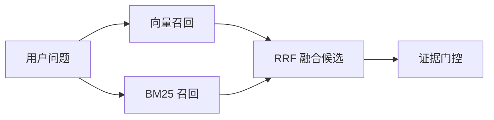
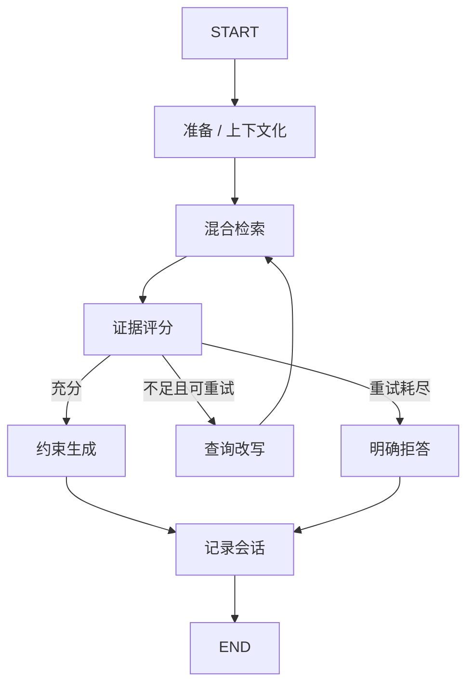

# OpsPilot - Agentic RAG

OpsPilot 是一个面向企业知识问答的 Agentic RAG 项目。它使用 Python、LangChain 和 LangGraph 实现混合检索、证据评分、查询改写、失败重试、来源引用、无证据拒答、多轮上下文、Cross-Encoder 重排，并通过 FastAPI 和 Streamlit 提供可演示产品。

默认 local 模式不需要 API Key，结果可重复，适合本地开发与演示；切换配置后可以使用 OpenAI 或兼容接口完成真实 Embedding、查询改写和答案生成。

## 已完成功能

### 基础 RAG
- Markdown、TXT、PDF 文档加载与分块
- 本地可重复 Hash Embedding，支持中文字符 n-gram
- 无外部分词服务的中英文 BM25 检索
- 向量与 BM25 双路召回、加权 RRF 融合
- 可选 Cross-Encoder 二阶段语义重排
- 双信号证据门控、无证据拒答和结构化来源引用
- vector、hybrid、hybrid_rerank 三种策略对照评测

### LangGraph 工作流
- StateGraph 显式状态和条件边
- 多轮问题指代补全与本地/大模型查询改写
- 检索证据评分及原因说明
- 最多 N 次有界重写与重新检索
- 直接回答、重试恢复、最终拒答三类路径
- 使用 thread_id 延续多轮会话
- SQLite Checkpointer 持久化

### 评测
- 36 条分层评测集，覆盖 error_code、policy、procedure 等类型
- 基础检索对照：纯向量 vs 混合检索 vs 重排
- 图级对照：基础 RAG vs LangGraph RAG
- 指标：Hit Rate@K、MRR、答案关键词召回率、拒答准确率

## 检索与重排架构



## LangGraph 架构



## 评测结果

### 基础检索对照
本地模式、Top-K=4，在 8 份文档和 36 条评测问题上：

| 策略 | Hit Rate@4 | MRR | 答案关键词召回 | 拒答准确率 |
|---|---:|---:|---:|---:|
| 仅向量 | 1.000 | 0.952 | 0.710 | 0.944 |
| 向量 + BM25 + RRF | 1.000 | 0.952 | 0.774 | 1.000 |
| 混合检索 + 重排 | 1.000 | 0.984 | 0.796 | 1.000 |

### LangGraph 对照
在 10 条包含口语化弱查询、精确错误码和无答案问题的图级数据上：

| 指标 | 基础 RAG | LangGraph RAG |
|---|---:|---:|
| 回答/拒答决策准确率 | 0.700 | 1.000 |
| 期望来源命中率 | 0.571 | 1.000 |
| 答案关键词召回 | 0.429 | 0.643 |

以上数字由 `scripts/evaluate.py`、`scripts/evaluate_graph.py` 和
`scripts/benchmark_retrieval.py` 在本地 local 模式重新生成，报告见
`reports/evaluation.json`、`reports/graph_evaluation.json` 和
`reports/retrieval_comparison.json`。

## 快速开始

需要 Python 3.11 或 3.12。

```bash
pip install uv
uv sync --extra dev --extra demo
uv run python scripts/ingest.py
uv run uvicorn app.api:app --reload
```

浏览器打开：
- API 文档：http://127.0.0.1:8000/docs
- Streamlit 界面：http://127.0.0.1:8501

## 配置

```dotenv
RAG_MODE=local
RETRIEVAL_STRATEGY=hybrid_rerank
TOP_K=4
CANDIDATE_K=12
MIN_RELEVANCE_SCORE=0.18
MAX_REWRITES=1
```

## 项目结构

```
opspilot/
├── app/
│   ├── config.py               # 环境配置
│   ├── embeddings.py           # 本地/在线 Embedding
│   ├── generator.py            # 答案生成
│   ├── graph/
│   │   ├── rewriting.py        # 查询改写
│   │   ├── state.py            # 图状态
│   │   └── workflow.py         # LangGraph 工作流
│   ├── index.py                # 索引管理
│   ├── loaders.py              # 文档解析
│   ├── models.py               # 数据模型
│   ├── persistence.py          # Checkpointer
│   ├── retrieval.py            # BM25、RRF 和重排
│   └── service.py              # RAG 服务
├── frontend/
│   └── streamlit_app.py        # 演示界面
├── scripts/
│   ├── ingest.py               # 文档入库
│   └── evaluate.py             # 评测
├── tests/
└── pyproject.toml
```

## 设计决策

1. 为什么基础 RAG 和 LangGraph 接口同时保留？基础接口是可重复的实验对照组。
2. 为什么不让模型无限重试？检索重试必须有上限，否则会扩大延迟和成本。
3. 为什么 Cross-Encoder 不直接搜索整个知识库？必须联合编码每个 query-document 对，计算昂贵，先通过向量与 BM25 召回缩小候选范围再精排。
4. 当前最大局限？36 条合成评测样本仍小，下一步应增加更多真实业务场景数据。
