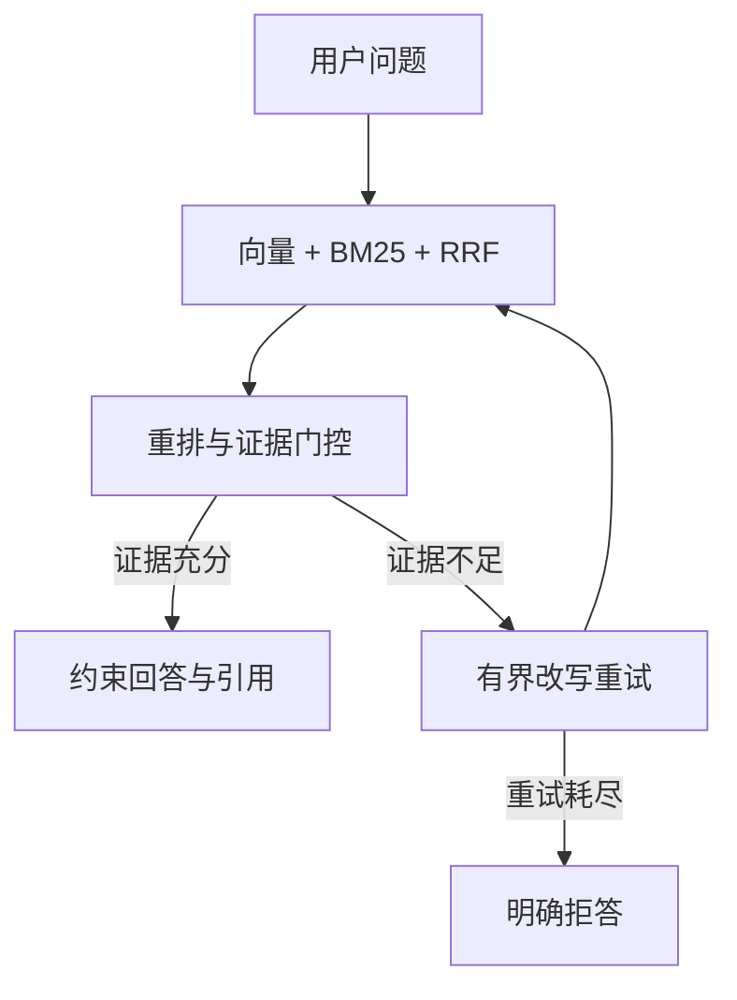

# OpsPilot 项目演示与技术评审指南

## 1. 项目一句话

OpsPilot 是一个可评测、可复现的 Agentic RAG：用混合检索回答企业知识问题，
在证据不足时进行有界改写重试，仍不足则明确拒答，并保留完整执行轨迹与来源引用。

## 2. 10 分钟演示路线

### 0:00–1:00：先讲问题与边界

- 企业问答不仅要“回答得像”，还要证明证据来自哪里。
- 本地模式无 API Key、确定性可复现，适合演示；真实语义效果需要切换在线 Embedding
  与生成模型。

### 1:00–3:00：展示弱查询改写

在 Streamlit 输入：

> 这个报错怎么处理？

先在同一 `thread_id` 中问一个包含 `AUTH-403-DATA` 的问题，再用上面的指代式追问。
展开“Agent 执行轨迹”，指出：

- `prepare_query` 用历史上下文化问题；
- `grade_evidence` 独立判断证据；
- 证据不足时进入有界 `rewrite_query`，不会无限循环；
- 响应保留每次查询、分数、原因和来源。

### 3:00–5:00：展示检索对照

打开 `reports/retrieval_comparison.json`，对比：

| 策略 | MRR | 答案关键词召回 | 拒答准确率 |
|---|---:|---:|---:|
| Vector | 0.952 | 0.710 | 0.944 |
| Hybrid | 0.952 | 0.774 | 1.000 |
| Hybrid + Rerank | 0.984 | 0.796 | 1.000 |

强调这是 36 条人工整理的合成样本，只用于工程回归，不外推为生产效果。继续打开
`reports/evaluation.json` 的 `breakdowns`：hard 样本来源命中仍为 `1.000`，
但答案关键词召回只有 `0.633`，说明瓶颈已从“能否找到”转向“能否完整组合答案”。

### 5:00–7:00：展示拒答与重试恢复

输入“公司食堂今天的午餐菜单是什么？”：展示证据评分未通过后进入改写重试，改写耗尽后
明确拒答。再用口语化弱查询展示改写恢复路径，例如多轮指代追问“这个报错怎么处理”。

### 7:00–10:00：展示工程可信度

本地运行：

```bash
uv sync --locked --extra dev --extra demo
uv run ruff check .
uv run pytest
uv run python scripts/evaluate.py --output reports/evaluation.json
uv run python scripts/evaluate_graph.py --output reports/graph_evaluation.json
uv run python scripts/benchmark_retrieval.py --output reports/retrieval_comparison.json
```

打开三份报告，说明每项数字都可以从当前代码重新生成，并明确本地确定性模式与在线模型
效果的边界。

## 3. 架构讲解主线



## 4. 高频追问

### 为什么要保留基础 RAG？

它是实验对照组。没有基础接口，就无法证明 LangGraph 改写与重试提高了质量，还是只
增加了延迟和复杂度。

### 为什么不只依赖向量数据库？

错误码、字段名和缩写更适合精确词项匹配；语义近似问题更适合向量召回。BM25 与向量
双路召回后用 RRF 融合，可以避免分数尺度不一致。

### LangGraph 的价值是什么？

不是“用了一个图框架”，而是把准备、检索、证据评分、改写、停止条件和会话记录变成
显式状态机，并能针对节点路径做评测和审计。

### 当前最真实的不足是什么？

- 演示语料和人工整理的合成标注集仍小，尚未做双人标注一致性统计；
- 本地 Hash Embedding 是 n-gram 词法近似，不是语义向量；真实语义和在线生成尚未评测；
- 评测延迟是单机本地数值，只用于相对比较；
- 鉴权、ACL、工单审批、PostgreSQL 与可观测性未实现，属于后续工作。

## 5. 演示前检查清单

- `uv sync --locked --extra dev --extra demo`
- `uv run ruff check .`
- `uv run pytest`
- 启动 API，确认 `/health/live` 与 `/health/ready`
- 启动 Streamlit，完成一次弱查询改写和一次拒答
- 准备 `reports/evaluation.json`、`reports/graph_evaluation.json`、
  `reports/retrieval_comparison.json`
- 不展示真实 API Key，明确区分本地已验证结果与生产待验项
