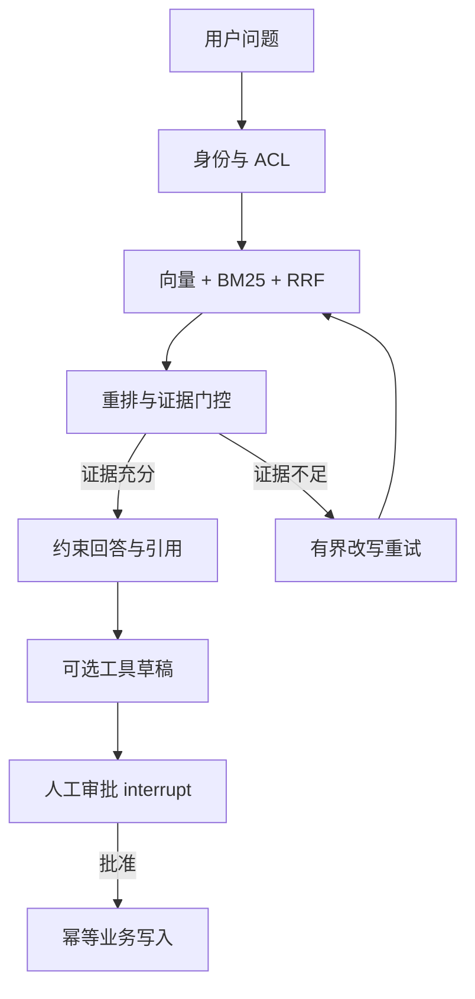

# OpsPilot 项目演示与技术评审指南

## 1. 项目一句话

OpsPilot 是一个面向企业知识与运维流程的 Agentic RAG：既能用可评测的混合检索回答
问题，也能在提交工单等有副作用操作前强制人工审批，并把权限、持久化、审计、限流、
可观测性和云原生发布纳入同一个可验证工程。

## 2. 10 分钟演示路线

### 0:00–1:00：先讲问题与边界

- 企业问答不仅要“回答得像”，还要证明证据来自哪里。
- 未授权文档必须在召回阶段过滤，不能进入重排、模型上下文或 trace。
- 创建工单属于有副作用操作，模型只能生成草稿，不能绕过人工批准。

### 1:00–3:00：展示弱查询改写

在 Streamlit 输入：

> 这个报错怎么处理？

先在同一 `thread_id` 中问一个包含 `AUTH-403-DATA` 的问题，再用上面的指代式追问。
展开“Agent 执行轨迹”，指出：

- `prepare_query` 用历史上下文化问题；
- `grade_evidence` 独立判断证据；
- 证据不足时进入有界 `rewrite_query`，不会无限循环；
- 响应保留每次查询、分数、原因和来源。

### 3:00–5:00：展示检索对照

打开 `reports/retrieval_comparison.json`，对比：

| 策略 | MRR | 答案关键词召回 | 拒答准确率 |
|---|---:|---:|---:|
| Vector | 0.952 | 0.720 | 0.944 |
| Hybrid | 0.952 | 0.785 | 1.000 |
| Hybrid + Rerank | 0.984 | 0.806 | 1.000 |

强调这是 36 条人工整理的合成样本，只用于工程回归，不外推为生产效果。继续打开
`reports/evaluation.json` 的 `breakdowns`：hard 样本来源命中仍为 `1.000`，
但答案关键词召回只有 `0.667`，说明瓶颈已从“能否找到”转向“能否完整组合答案”。

再打开 `reports/ablation_evaluation.json` 解释取舍：BM25 修复两个错误码用例；
重排使 MRR 提升 `0.032`；阈值 `0.18` 同时避开放宽后的误答与收紧后的误拒；
第 1 次改写恢复三个弱查询，第 2 次没有质量增益，因此默认只允许一次。

### 5:00–7:00：展示工具审批

1. 创建“修复跨部门订单权限”的工单草稿。
2. 展示 `interrupt()` 已返回完整 `submit_ticket` 参数。
3. 说明此时业务工单表仍为零新增。
4. 修改优先级后批准。
5. 展示最终工单、审计事件和稳定 `workflow_id` 幂等键。

### 7:00–8:30：展示安全设计

- JWT 只保存用户 ID，每次请求重新读取角色、部门和 Scope。
- OIDC 只证明外部身份，应用用户表仍负责授权与撤销。
- 本地索引在重排前过滤 ACL；pgvector 把 ACL 谓词下推 SQL。
- 相同外部 `thread_id` 会按用户命名空间隔离。

### 8:30–10:00：展示工程可信度

本地无基础设施时运行：

```bash
uv run python scripts/acceptance.py
```

配置隔离 PostgreSQL 源库和恢复库后，使用
`uv run python scripts/acceptance.py --require-infrastructure` 执行全量验收。

打开 `reports/ACCEPTANCE.md`，说明：

- 每项检查有通过、失败或跳过状态；
- 报告产物记录大小和 SHA-256；
- 输出会脱敏数据库密码、Bearer Token 和 API Key；
- 缺少真实 PostgreSQL 或恢复环境时显示 `partial`，不会冒充生产验收完成。

## 3. 架构讲解主线



建议按“质量 → 控制 → 生产化”三层讲：

1. 质量：对照组、数据集、检索指标、图级指标。
2. 控制：证据门控、ACL、人工审批、幂等与审计。
3. 生产化：PostgreSQL、迁移/恢复、SLO、OTel、Helm 和回滚。

## 4. 高频追问

### 为什么要保留基础 RAG？

它是实验对照组。没有基础接口，就无法证明 LangGraph 改写与重试提高了质量，还是只增加了
延迟和复杂度。

### 为什么不只依赖向量数据库？

错误码、字段名和缩写更适合精确词项匹配；语义近似问题更适合向量召回。BM25 与向量双路
召回后用 RRF 融合，可以避免分数尺度不一致。

### 为什么权限一定要在召回阶段？

如果未授权文本先进入候选，再在最终答案隐藏，它仍可能泄漏到重排器、模型上下文、
trace 或缓存。安全边界必须在任何后续消费者之前。

### LangGraph 的价值是什么？

不是“用了一个图框架”，而是把准备、检索、证据评分、改写、停止条件、审批中断和恢复
变成显式状态机，并能针对节点路径做评测和审计。

### 当前最真实的不足是什么？

- 演示语料和人工整理的合成标注集仍小，尚未做双人标注一致性统计；
- PostgreSQL 17/pgvector 集成与隔离恢复已在本机容器验证，但不是托管生产环境；
- Kubernetes 静态门禁已通过，Kind/Helm 真实集群回滚仍需目标环境验证；
- Prompt Injection、恶意文档和跨身份访问已有本地对抗测试，但真实在线模型、
  企业 OIDC、组织级 `tenant_id` 与长时间容量仍需目标环境验证；
- 真实模型评测已能严格采集质量、P50/P95、Token 和价格快照成本，但当前没有授权
  API Key，因此尚无可对外声明的线上模型数字；
- CI 配置已具备，但只有推送 GitHub 并取得运行记录后才形成远端证据。

## 5. 演示前检查清单

- `uv sync --locked --extra dev --extra demo`
- `uv run python scripts/acceptance.py`
- 启动 API，并确认 `/health/live` 与 `/health/ready`
- 启动 Streamlit，完成一次弱查询改写
- 完成一次工单修改后批准
- 准备 `reports/ACCEPTANCE.md` 和六组评测 JSON
- 不展示真实 API Key、数据库密码或企业 Token
- 明确区分本地已验证结果与生产待验项
