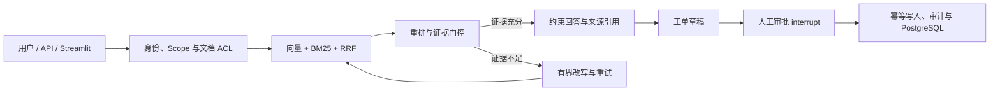

# OpsPilot 项目架构与工程能力概览

## 30 秒项目介绍

OpsPilot 是一个面向企业知识问答与运维流程的 Agentic RAG 项目。它不只展示
“调用模型得到答案”，而是把混合检索、证据门控、文档级权限、LangGraph 有界重试、
人工审批、幂等写入、审计、PostgreSQL/pgvector 持久化和发布验收组织成一条可复现、
可评测、可解释的工程链路。

## 核心工程能力

**OpsPilot｜Agentic RAG 企业知识与运维助手｜Python / FastAPI / LangGraph**

- 设计向量召回、BM25、RRF 融合与可解释重排链路；在 36 条人工整理的合成样本上，
  `Hit Rate@4=1.000`、`MRR=0.984`、答案关键词召回率 `0.806`、拒答准确率 `1.000`；
  按问题类型和难度分层定位 hard 样本要点召回仅 `0.667` 的改进方向。
- 使用 LangGraph 实现多轮上下文化、证据评分、有界查询改写和失败拒答；10 条图级样本中，
  决策准确率由基础 RAG 的 `0.700` 提升至 `1.000`，期望来源命中率由 `0.571`
  提升至 `1.000`；消融实验表明第 2 次改写无质量增益，将默认上限收敛为 1 次。
- 将文档 ACL 前置到召回阶段，并用 `interrupt()`、人工批准和 `workflow_id`
  幂等键约束有副作用的工单提交；12 条权限路径按 sales/support/ops 分层，
  各角色未授权来源泄漏率均为 `0.000`。
- 将用户问题、知识证据和工单请求作为不可信 JSON 传给模型；以污染文档、
  ACL 前置过滤、同名会话隔离和工单 ID 碰撞用例验证 Prompt Injection 与越权边界。
- 完成 PostgreSQL 17/pgvector 迁移、集成测试、备份恢复和证据化验收；统一验收扩展为
  11 项，远程 CI 覆盖隔离数据库恢复，恢复后 9 张关键表行数一致。

以上数字来自仓库内受控数据和 2026-07-26 本地隔离验收，不代表线上业务效果。

## 架构讲解图

技术评审时可按“质量、控制、生产化”三层展开：

1. **质量**：保留基础 RAG 对照组，用检索、图级、审批和权限数据集验证改动。
2. **控制**：未授权内容在任何重排、生成、追踪或缓存之前过滤；写操作必须人工批准。
3. **生产化**：迁移带漂移检测和锁，恢复演练核对关键表，验收报告保留状态、输出与哈希。

## 3 分钟项目导览

**0:00–0:30｜问题。** 企业 RAG 的难点不是让回答听起来合理，而是保证证据可追溯、
越权内容不可见，并且模型不能擅自执行有副作用的操作。

**0:30–1:20｜问答链路。** 输入一个口语化弱查询，展示向量与 BM25 双路召回、
RRF 融合、证据评分和 LangGraph 执行路径。证据不足时只做有限次数改写，仍不足就拒答。

**1:20–2:10｜安全与审批。** 切换不同角色展示文档 ACL；再创建工单草稿，指出
`interrupt()` 后数据库还没有新增工单，只有人工修改并批准后才执行幂等写入。

**2:10–3:00｜工程证据。** 打开 `reports/ACCEPTANCE.md`，说明本地测试、6 组评测、
Kubernetes 静态门禁、真实 PostgreSQL 集成和隔离恢复共 11 项全部通过，同时明确远程
CI、真实集群回滚、企业 OIDC 和在线模型效果仍需目标环境验证。

## 证据索引

- 统一验收：`reports/ACCEPTANCE.md`、`reports/acceptance.json`
- 检索对照：`reports/retrieval_comparison.json`
- 分层评测口径：`docs/EVALUATION.md`
- 消融实验：`docs/ABLATION.md`
- 图工作流：`reports/graph_evaluation.json`
- 审批与权限：`reports/ticket_workflow_evaluation.json`、`reports/access_evaluation.json`
- 恢复演练：`reports/recovery/`
- 完整项目演示：`docs/DEMO_GUIDE.md`
- 真实模型评测口径：`docs/ONLINE_MODEL_EVALUATION.md`

## 诚实边界

- 当前数据集较小，指标只用于工程回归，不能外推到开放域或生产流量。
- PostgreSQL 17/pgvector 和恢复已在本机隔离容器验证，不等同于托管生产数据库验证。
- Kubernetes 已在远程 CI 的临时 Kind 集群验证滚动发布和原子回滚；托管生产集群、
  长时间流量和真实 Secret 管理仍需目标环境验证。
- 本地对抗测试不等于真实模型红队；在线模型质量、成本、P95 延迟、企业 OIDC、
  组织级 `tenant_id` 和数据库 RLS 仍是后续工作。
