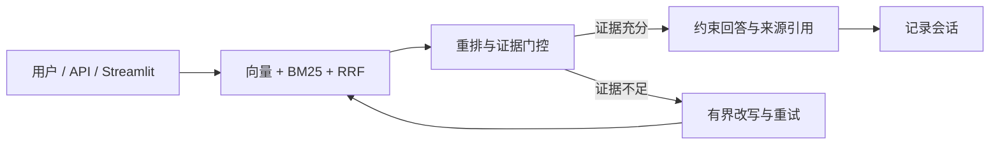

# OpsPilot 项目架构与工程能力概览

## 30 秒项目介绍

OpsPilot 是一个面向企业知识问答的 Agentic RAG 项目。它把混合检索、证据门控、
LangGraph 有界重试、来源引用和离线评测组织成一条可复现、可解释的工程链路。
默认 local 模式无需 API Key，结果可重复，适合本地开发、演示和评审。

## 核心工程能力

**OpsPilot｜Agentic RAG 企业知识助手｜Python / FastAPI / LangGraph**

- 设计向量召回、BM25、RRF 融合与可解释重排链路；在 36 条人工整理的合成样本上，
  `Hit Rate@4=1.000`、`MRR=0.984`、答案关键词召回率 `0.796`、拒答准确率 `1.000`；
  按问题类型和难度分层定位 hard 样本要点召回 `0.633` 的改进方向。
- 使用 LangGraph 实现多轮上下文化、证据评分、有界查询改写和失败拒答；10 条图级样本中，
  决策准确率由基础 RAG 的 `0.700` 提升至 `1.000`，期望来源命中率由 `0.571`
  提升至 `1.000`；消融实验表明第 2 次改写无质量增益，默认上限收敛为 1 次。
- 保留基础 RAG 对照组，用检索和图级数据集验证改动；本地模式确定性、可重复，
  切换配置后可使用 OpenAI 兼容接口完成真实 Embedding、改写和生成。

以上数字来自仓库内受控数据和 2026-08-04 本地运行，不代表线上业务效果。

## 架构讲解图

## 3 分钟项目导览

**0:00–0:30｜问题。** 企业 RAG 的难点不是让回答听起来合理，而是保证证据可追溯、
回答可复现，模型不会在证据不足时编造答案。

**0:30–1:20｜问答链路。** 输入一个口语化弱查询，展示向量与 BM25 双路召回、
RRF 融合、证据评分和 LangGraph 执行路径。证据不足时只做有限次数改写，仍不足就拒答。

**1:20–2:00｜评测证据。** 打开 `reports/evaluation.json` 与
`reports/retrieval_comparison.json`，对比三种检索策略和按难度/类型分层的切片指标。

**2:00–3:00｜工程边界。** 说明本地模式是确定性测试适配器，真实语义 Embedding、
在线模型生成、鉴权和生产化能力仍需后续工作。

## 证据索引

- 检索对照：`reports/retrieval_comparison.json`
- 基础评测：`reports/evaluation.json`
- 图工作流：`reports/graph_evaluation.json`
- 评测口径：`docs/EVALUATION.md`
- 项目演示：`docs/DEMO_GUIDE.md`

## 诚实边界

- 当前数据集较小，指标只用于工程回归，不能外推到开放域或生产流量。
- 本地 Hash Embedding 是字符 n-gram 的确定性适配器，不等同于语义 Embedding。
- 本地抽取式生成不等同于在线大模型质量；在线模型评测尚未执行。
- 项目当前不包含鉴权、ACL、工单审批、PostgreSQL 或可观测性实现，相关设计列为后续工作。
